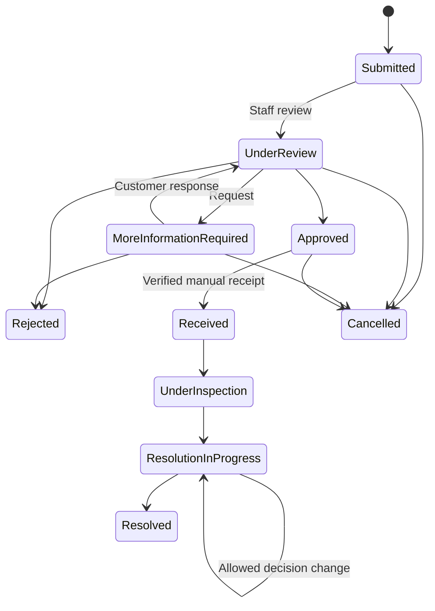

# Current local extension: Stage 2 PDC reverse logistics, 2026-10-08

Approved Claims now support explicit staff-confirmed PDC reverse pickup through the existing adapter/worker, separate immutable pickup/reference/history, guarded recovery/rebooking, private labels and dated pickup/transit/receipt transitions. Approval alone creates no job. Reverse events never enter normal order PDC SMS; no Claim SMS/email, refund/inventory/replacement-outbound integration.

Both Claims migrations remain **unapplied**: `20261008120000_after_sales_claims_core.sql` then `20261008160000_after_sales_reverse_logistics.sql`. No production access, credentials, migration/deployment or real provider call occurred. Full implementation/validation/limits: [after-sales-reverse-logistics.md](after-sales-reverse-logistics.md). Earlier Stage 1 entries below are historical. **STOP after Stage 2.**

# After-Sales Claims Core — local implementation, 2026-10-08

Stage 1 extends the deployed Warranty Entitlement and After-Sales Policy foundations. Code is local-only until a separately reviewed migration and release. No production connection, credential discovery, data modification, deployment, PDC/Vodafone call, SMS/email, financial execution or inventory action occurred.

## Audit and existing systems

Reviewed AGENTS, state/handoff, warranty/policy, PDC tracking, PDC SMS and central SMS records; inspected purchase snapshots, policy archives/resolver/period/eligibility helpers, owned orders, SKU/variant snapshots, account navigation/order detail, support conversations/tickets, private uploads, staff permissions/navigation/audit, reset dependencies and current migrations/tests.

Website orders have authenticated `user_id` ownership. Canonical checkout/preorder captures immutable warranty terms and a private policy-version reference; imported/historical missing terms stay unknown. The existing SQL helper behind `getReturnEligibility` and `getWarrantyEligibility` evaluates the two types independently. Invoice dates still have no authoritative website adapter. Durable matching PDC delivery evidence is read without courier requests or current-mapping reinterpretation.

Support tickets/messages are ticket-linked; order messages are order-linked and include existing commerce communications. Neither models item quantity, purchased-policy admission or the Claims lifecycle. Claims therefore use one order-linked domain with timeline events also holding internal notes; they do not create another generic ticket application or automatically open a support ticket. Existing My Account layouts/navigation, customer/staff authentication, permissions, private-upload conventions, request bounds and generic staff audit are reused. Existing Support, Messages, Live Chat, payment, packing, outbound PDC and SMS flows remain separate.

## Schema and migration

**Unapplied migration:** `20261008120000_after_sales_claims_core.sql`, after the 63 foundation migrations. The repository now has 64 migration files. Production's last recorded alignment remains 63; no linked history or production credentials were accessed in this task.

| Private table | Purpose |
| --- | --- |
| `after_sales_claims` | RETURN/WARRANTY, owned order/item, quantity, purchased policy reference, customer declarations/serials, bounded eligibility context, workflow and decision |
| `after_sales_claim_events` | Append-only timeline; visibility separates internal staff notes from customer communication |
| `after_sales_claim_information` | Immutable request text/actor/time; one pending request, one preserved response |
| `after_sales_claim_evidence` | Owned private staged uploads, ready/hash metadata, immutable submitted attachments and removal tombstones |

Indexed customer/queue/order/timeline/staging reads; random UUID identities and unique `AS-R-`/`AS-W-` plus 16 random hexadecimal characters; no sequential customer reference. No historical claims/backfill or policy-default changes. Existing business rows and canonical function bodies are verified unchanged by the disposable migration test. The existing permissions-default function is retained under a wrapper; seven new capabilities default false and existing admin rows are unchanged.

All four tables have RLS and no browser grants. Mutations go through service-only actor-checked RPCs. Service-role direct writes are revoked; canonical write guards protect immutable context, events and submitted evidence, including DELETE/TRUNCATE. The existing reset planner recognizes retained Claims tables. Its dependency guards block erasing linked orders/customers and retained evidence metadata, including unsubmitted records; no silent cascade or storage erasure is introduced. Other empty-table reset scopes remain compatible. No reset was performed outside disposable tests.

## My Account and Dashboard

`/account/after-sales` belongs to both existing account layouts and links from owned order details. Purchased items and claim history have bounded pagination. Server availability distinguishes unknown policy, disabled claims, expired/pending periods, no warranty, active claims and reserved quantities. Disabled/unconfigured historical purchases gain no Start Claim buttons.

Return and Warranty forms are separate. Return uses enabled **purchased** bilingual reasons, opened/packaging declarations and applicable per-reason evidence rules. Warranty uses purchased terms, issue text, policy-driven evidence and optional/required supplied serials. Customers review submission before persisting; they never select a guaranteed commercial resolution. Details show timeline, decisions, attachments, requested-information actions and conservative cancellation. All new copy supports EN/AR/RTL/mobile/desktop/Light/Dark/System through existing styling and i18n.

`/dashboard/after-sales` has type/status filters and bounded reference/order/customer search. Detail shows order/customer contact context, purchased item/SKU/warranty, date evidence, immutable policy reference/revision key, original eligibility/admission, supplied serial state, private evidence, attributed timeline and internal notes. The server returns only actions allowed by status and current permissions. Read-only staff have no mutation controls. Internal note bodies and verification rationale never enter customer projections; evidence metadata/downloads require the separate staff evidence capability.

## Admission and provenance

Creation locks the owned item and re-evaluates the existing SQL eligibility helper immediately before persistence. Earlier browser previews cannot authorize later expired, disabled or otherwise invalid submissions. Dates, duration, policy, actor, evidence presence and eligibility are not accepted from browser assertions. Submission context stores only the relevant helper outcome/period, evaluation time, ready-evidence count and declaration/serial source; the existing immutable policy archive remains the rule/provenance source rather than duplicating its whole JSON.

Purchased configured/enabled rules govern the relevant type. Current catalog or global edits do not reduce previously captured purchase rights or retroactively configure unknown history. Purchased reason enablement/overrides are preserved with that archive; a reason disabled in that purchased catalog is refused. Required packaging, forbidden opened items, closed/refunded orders, disabled claims, missing policy/dates and expired/not-started windows cannot silently pass.

There is **no general exceptional-policy override**. Two narrow review paths retain their original unknown outcome: a purchased policy permitting manual opened-item review with explicit declarations, and an active warranty with required customer-provided serials awaiting staff verification. Required files and packaging still apply. Staff approval records a separate reason/actor/time; it does not rewrite original eligibility. Timely submission retains its original period during subsequent review; waiting for staff does not itself expire the case. Current closed/refunded-order guards still prevent approval/resolution decisions.

## State machine and resolutions



Central SQL transition/action rules, current role permissions and optimistic revisions reject arbitrary/stale writes. Staff cannot skip a pending information request by restarting review. Cancellation stops before receipt; terminal claims permit only additional private staff notes. Information requests retain prompt, staff actor/time and response state. Customer response transactionally appends permitted ready evidence, stores the response, emits timeline events and returns to review.

Status and resolution remain separate. Warranty choices are only Repair, Replacement, Refund or Service Center Referral enabled in the purchased archive. Returns conservatively record a **refund decision only**; exchanges/financial execution are not inferred from existing inventory-return tables. A resolution can be changed with a reason before closure, within those same limits. Resolved requires an allowed recorded resolution and outcome text. Refund UI explicitly explains that the decision does not confirm money was issued. No Paymob/payment/credit/order-refund status, inventory replacement/restock or accounting transaction is executed.

`pickup_scheduled` and `in_transit` are reserved constrained statuses for Stage 2. Stage 1 offers no transition/action to set them. Approval exposes logistics readiness only; manual receipt requires authorized staff text and changes only the Claim.

## Quantity, duplicates and serials

A row may contain multiple units. Claims request integer quantity 1–99 bounded by purchased/remaining quantity. A partial unique index prevents more than one active claim per item/type; the item lock also reserves quantities across both types. Rejected/cancelled quantities are released. Resolved Warranty allows a later distinct issue. Resolved Return consumes that returned-decision quantity so the same aggregate units cannot receive another return decision. Actual physical-unit association remains future Product Management work; no unit/QR identity is invented.

Existing assigned vendor `serial_number` data is read separately from unit/QR codes. Without sufficient authoritative purchased serials, Optional/Required policy permits one supplied serial per claimed unit. Supplied values are always explicitly unverified at submission. Required serial review cannot be approved until authorized staff records verification with an audited reason. That verification is a claim-review fact, not a new inventory/QR ownership link; no serialized unit is modified. Disabled serial policy rejects supplied serial input.

Guest/anonymous access is excluded. No order-number/email verification shortcut, account impersonation or guest Claims architecture is introduced. Customer reads and actions require an active authenticated owned order. Normal refresh is used; no new public or unverified Realtime channel is added.

## Evidence and privacy

New private Supabase bucket **`after-sales-evidence`**, 5 MiB per file; JPG/JPEG, PNG, WebP and PDF only. Video and executables are unsupported. Existing Live Chat multipart/signature/extension/hash validation is reused, with bounded actual request bytes, a read deadline, safe UTF-8 filenames and generated server paths. Upsert is false and retries must match reserved content/metadata. The private bucket has no browser-granting policy; a restrictive `storage.objects` boundary denies its objects even alongside broad permissive project rules while leaving other bucket rules intact.

At most five unsubmitted files per item/type and twenty submitted files per claim. Required/optional/disabled evidence comes from the purchased effective type/reason policy. Ready files are counted by SQL, never a browser `evidence=true` flag. Reservation/completion/deletion and claim attachment share item locking. Initial/response draft files may be removed/replaced; after submission neither customer nor staff can silently erase them. Additional files are committed with request/customer provenance when responding. Staged uploads expire for submission after 24 hours; the UI recovers owned unfinished uploads for explicit removal. Removal tombstones metadata before deleting storage bytes, protecting racing submissions. Failed physical cleanup needs a later authorized orphan-cleanup operation; no scheduler/retention purge was installed here.

Downloads authorize active ownership or `claims.view` plus `claims.evidence`, check stored size/hash, and stream via an authenticated server proxy with private/no-store, forced attachment, nosniff and sandbox headers. Storage paths/service credentials are not sent to browsers. Timeline paging excludes private notes **before** counting/cursors, so hidden events do not appear as customer pagination. Staff audit is atomic with state/timeline changes and stores controlled claim references/status/resolution, not evidence bytes or private note text. Audit outage rolls back the action.

## RBAC

`claims.view`, `claims.review`, `claims.manage`, `claims.evidence`, `claims.notes`, `claims.decide`, `claims.resolution` follow existing permission groups/dependencies and route guards. View is required with each specific capability. Owner behavior is retained; existing non-owner roles receive no new grants. Database actor checks repeat server authorization. Customer ownership is independent of staff permissions.

## Validation and limits

Final local validation: **506 full-suite passes / one existing optional native concurrency skip; 22 focused Claims passes; typecheck/build/diff passed**. Full suite used `--test-concurrency=1` after the scheduling-sensitive parallel Paymob case. Existing ERP import/build warnings remain; no new duplicate-import warning remains. Focused Claims SQL/HTTP tests cover input spoofing, disabled/history/date/reason/override admission, server re-evaluation, ownership, immutable purchase references, active duplicates, combined quantities/terminal behavior, evidence MIME/signature/size/ownership/private download/deletion, serial review, information response, workflow/resolution rules, private notes, stale writes, browser RLS/RPC denial, reset dependencies and atomic audit outage. A restrictive Storage test explicitly simulates a broad permissive rule. The migration test compares existing business records and canonical function bodies against the 63-migration checkpoint.

Browser: **496 assertions / 120 states / 120 screenshots / 235 JSON responses**, actual compiled Vue components + final built CSS + real H3 handlers/RBAC/disposable SQL. EN/AR/RTL/1440/390px/Light/Dark/System/OS switches; available/unavailable purchases, separate forms/confirmation, disabled/optional/required evidence, supplied-serial provenance, claim list/detail/history, read-only staff, information response/private upload/download, review/notes/approve/manual receipt/inspection/allowed resolution/resolved and no financial/logistics ledgers. Zero browser errors/external requests. Artifact root: `/tmp/elcomputer-claims-core-browser/`.

Auth and Storage transport are **isolated fixtures**. Real signed-in Supabase persistence, real Storage quota/provider behavior, independent native PostgreSQL concurrency and production acceptance are **NOT VERIFIED**. No credentials or production records were obtained/manufactured. An initial parallel full suite hit the existing 40 ms Paymob scheduling-sensitive fixture; payment code was unchanged. The added Storage test initially lacked browser schema usage in its fixture; correcting the fixture verified the intended restrictive-policy scenario.

## Remaining work and boundaries

- Separate migration/release authorization and real authenticated Supabase/Storage/native concurrency acceptance; approve real future-purchase business rules. Historical unknown entitlements remain unavailable without a separately authorized authoritative process.
- **Stage 2:** approved-claim reverse shipment identity/idempotency, pickup/transit/receipt integration and safely isolated provider event handling. No existing outbound PDC webhook/tracking/SMS behavior was changed here.
- **Stage 3:** separately approved Claim SMS/email producers/templates/recipient policy and milestone handling. No notification code, queue intent, scheduler or provider configuration exists in this core.
- Separate financial/fulfillment/ERP decisions for refund execution, credits, replacements/restocking, and future serialized-unit/QR association. Claim closure currently records case decisions only.

**STOP after Claims Core. No reverse logistics or communications work begins.**

## Required flags

```text
AFTER SALES CLAIMS CORE IMPLEMENTED: YES
MY ACCOUNT AFTER SALES CENTER IMPLEMENTED: YES
RETURN CLAIM WORKFLOW IMPLEMENTED: YES
WARRANTY CLAIM WORKFLOW IMPLEMENTED: YES
POLICY ELIGIBILITY ENFORCED SERVER-SIDE: YES
PURCHASE-TIME POLICY PROVENANCE PRESERVED: YES
EVIDENCE UPLOADS IMPLEMENTED: YES
EVIDENCE REQUIREMENT POLICY-DRIVEN: YES
CUSTOMER-PROVIDED SERIAL MARKED UNVERIFIED: YES
CLAIM STATE MACHINE SERVER-ENFORCED: YES
STATUS AND RESOLUTION SEPARATED: YES
INTERNAL NOTES PRIVATE: YES
CUSTOMER CLAIM TIMELINE IMPLEMENTED: YES
PDC REVERSE SHIPPING CONNECTED: NO
CLAIM SMS CONNECTED: NO
CLAIM EMAIL CONNECTED: NO
AUTOMATIC REFUND EXECUTION CONNECTED: NO
PRODUCTION MIGRATION APPLIED: NO
PRODUCTION DEPLOYED: NO
```
