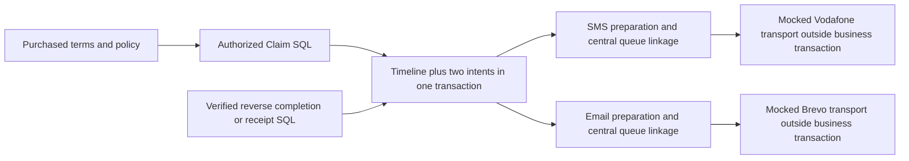

# Final After-Sales integration and security audit — 2026-10-10

**Verdict: suitable for a separately authorized dormant deployment, after the deployment computer verifies the checkpoint, migration identities, backups and OFF controls. No Critical/High code issue remains in this review. Live activation is not accepted.**

Reviewed clean `main` at `8288cb58fc475597af0667db80ea25d0a207a72c`, containing Claims `c43b1f2`, reverse logistics `f13ccf2`, Email `6ecac1e`, Email audit `c188573` and communications `8288cb5`. Normal Git fetch confirmed the starting commit matched `origin/main`. Read project instructions/state/handoff, required feature documents and relevant payment, account/authentication, checkout/preorder, PDC and Support/Live Chat records; traced actual server handlers, components, SQL, grants, workers and tests. Previous reports were context; execution results below are fresh.

Production's **63-migration checkpoint is user-reported and was not refreshed**. There are 67 local migration files. No production Supabase/VPS access, credentials discovery, deployment, migration application, policy/provider activation, real provider call/message, refund, replacement fulfillment, Auth or DNS change occurred. Only disposable local fixtures were configured. Browsing official Brevo documentation was read-only documentation access, not a Brevo API call.

## 1. Readiness

The additive system can remain dormant without creating historical Claims, reverse jobs or sendable communications. Policies and provider configuration are retained; new reverse and all seven event/channel controls default OFF. New staff permissions default false. This conclusion concerns the reviewed code/local SQL. Current production controls, runtime settings and migration parity require independent verification before a future release. The audit does not authorize that release.

Docker is unavailable on this computer. Native PostgreSQL 17.11 was available and actually used; its helper accepts executable/driver paths, creates an owned loopback cluster and destroys it afterward. The Supabase Auth/Storage schemas in that harness are substitutes. Real Supabase Auth and object-storage acceptance remains **UNVERIFIED**.

## 2. Findings by severity

| ID | Severity | Reproduced defect | Correction and regression |
| --- | --- | --- | --- |
| AS-01 | Medium | A null action passed SQL three-valued `NOT IN` checks and cancelled a Resolved claim through the service RPC; HTTP rejected it already | Explicit null rejection in migration 64; unchanged terminal claim/revision/history asserted |
| AS-02 | Medium | Reverse persistence accepted a missing/null AWB with a valid REF and could record Received; missing source also passed its SQL guard | Null-safe exact AWB comparison and explicit source rejection in migration 65; null/absent/wrong identity cannot create history or receipt; null reverse operations also reject |
| AS-03 | Medium | A worker read settings A, then took a newer booking captured under settings B; SQL checked B while transport still used A | Bind the actual transport account/mode/URL/encrypted credential/label configuration into final SQL authorization; reproduced account-change race now makes zero mock calls and retains Approved |
| AS-04 | Medium | Queued reverse labels could call PDC after the requesting staff member was deactivated/revoked | Recheck active Claims/logistics view/create permissions before label lease; revoked fixture makes zero calls and records failed preparation |
| AS-05 | Medium | Shipping worker authorization was checked only at ingress; reverse work could continue after worker-secret revocation | Recheck current secret before reverse work and on both sides of final SQL authorization, plus before label transport; revoked fixture cannot call transport |

All five new regressions failed against the starting implementation and pass after correction. Only **unapplied 64 and 65** were corrected. Migrations 1–63, Email 66, communications 67, Vodafone algorithm, outbound shipping implementation, payments and Auth are unchanged. No interface redesign or new business feature.

Critical: none identified. High: none identified. Five Medium defects: fixed. Remaining Medium governance limitation: arbitrary trusted staff/template prose cannot be mechanically certified non-promotional or evidence of financial execution; restrict permissions and approve bilingual content before activation. Remaining Low operational limitation: retained private evidence/messages and failed physical cleanup need an explicit retention/orphan procedure. These are activation prerequisites, not reasons to invent a classifier, cleanup scheduler or financial workflow in this audit.

## 3. Fix boundaries and residual limits

Changed the canonical customer action guard, reverse identity/source/operation guards, reverse dispatch/label authorization, existing shipping worker's secret callback and regression harnesses. The transport configuration arguments are optional, preserving old positional/named caller arity through defaults; the corrected worker always supplies them. Older code does not gain the new snapshot binding. Keep reverse/provider gates OFF during code rollback; do not reactivate an older worker.

A committed disablement/revocation ahead of the final check prevents a later request. A request already authorized/in flight cannot be recalled. No provider network request runs while SQL holds business locks. Worker interruption after leasing remains conservatively recoverable/uncertain, rather than blindly recreating a shipment. Labels are permission-checked at lease time; this is not an unlimited guarantee against a rights change after authorization.

## 4. Four migrations, actual execution order

| # | Migration | SHA-256 of reviewed source | Result |
| --- | --- | --- | --- |
| 64 | `20261008120000_after_sales_claims_core.sql` | `f6bc35160ed6c6d20682c6ad4fb1d2f6554a1b71538b34bd4127ab04be760314` | Corrected null action; fresh and populated native application passed |
| 65 | `20261008160000_after_sales_reverse_logistics.sql` | `833b36b9dcf7acefbc47de95b2f21af64202b94233d73e673328348aaa8942d2` | Corrected reverse authorization/identity; fresh and populated native application passed |
| 66 | `20261008180000_email_foundation.sql` | `e32c88ad21f6fb971bcf82da293857d10eb6a4f5eb25bcf219392597ab78784d` | Unchanged; fresh and populated native application passed |
| 67 | `20261009120000_after_sales_communications.sql` | `df83fed86e8cb119a67b12e84974de059c665ea3b449c5d8724f5e35e9543f63` | Unchanged; fresh and populated native application passed |

Fresh application uses the actual application schema backup plus all 67 migrations in a newly initialized database. Upgrade independently stops before 64, populates checkpoint 63, then executes 64→65→66→67. This is not a hosted Supabase CLI migration test. Statements are transactional; migration 67 requests PostgREST cache reload. Deployment must verify the new defaulted RPC signatures/cache before workers can use them.

## 5. Schema and dependency compatibility

Claims depend on existing owned order/item/profile and immutable policy-version records. Reverse jobs depend on Claims and existing shipping settings/history/mappings. Email follows reverse because its reset integration expects that retained schema. Communications depends on all three plus central SMS/templates/queues. Foreign keys use restrictive retention, not silent deletion of new private history. Unique active Claims/quantity guards, one active reverse job, shared AWB advisory locking, occurrence/channel and central linkage uniqueness are compatible.

Thirteen new private tables have RLS, no browser grants and SELECT-only direct service access; canonical RPCs mutate them. Security-definer functions have fixed empty search paths. Preserved implementations and powerful helpers are browser-denied; renamed queue/Claim implementations cannot bypass canonical wrappers. Reset recognition is extended in order and configured/retained data blocks destructive scopes.

Constraint replacement in migration 65 expands allowed event/actor enums without deleting history. There is no destructive business-data rewrite. The preexisting `product_images_variant_required_check` was deliberately NOT VALID at checkpoint 63; its validation state is preserved. No new unvalidated constraint appears. That unrelated historical catalog constraint was not repaired in this audit.

## 6. Historical data preservation

The native populated checkpoint includes draft purchases, an imported item with unknown entitlement, configured purchased rights, quantities, normal/preorder/Card orders, Paymob attempts/transactions, outbound AWB/status history, suppressed Order/PDC SMS intents, support tickets, chat, users and existing configuration/catalog rows. **101 public tables / 29 populated tables** retain every preexisting row/column. **202 preexisting function bodies** remain identical under their documented names or wrappers, excluding intentional permission/reset extensions. Existing Auth users, Storage object metadata and prior bucket rows also remain identical.

New Claims/reverse/Email/communication ledgers are empty after upgrade. Seven communications settings and Brevo/reverse controls are OFF. No migration scans historical business events, creates provider work, guesses entitlement or enables configuration. These are disposable-data results; no statement about current production counts is implied.

## 7. Customer journey

Actual Vue/H3/disposable SQL journeys pass for purchased-item availability, separate Return/Warranty forms, declarations/serial/evidence, confirmation, reference, customer history/timeline, requested response/evidence, cancellation and recorded outcomes. Reverse and communications integrations use the same detail and timeline. Exact customer ownership is repeated in SQL and APIs. Browser state never approves a claim or executes shipping.

Admission denies historic unknown/draft/disabled/no-warranty/expired/pending or unavailable dates. Multi-unit and cross-type reservations cannot exceed purchased quantity. Active duplicates fail; rejected/cancelled capacity releases; resolved Warranty permits a later issue and resolved Return consumes its returned quantity. These limits use aggregate units; a new physical serial/QR association is not implemented.

## 8. Staff workflow

List/search/type/status filters, review, private notes, evidence permissions, information requests, approval/rejection, manual receipt, inspection, purchased allowed resolution and closure pass. Read-only and separately scoped reviewers/deciders/managers/logistics/communications staff cannot exceed their permissions. Stale revisions fail. Booking requires explicit confirmed pickup and appropriate handling context; approval alone creates no job. Operational history, recovery, labels and masked communications are separately permission-gated. Staff attribution and existing audit insertion are atomic with writes.

## 9. Eligibility and purchased policy

SQL exclusively consumes immutable purchased duration and policy archive, including scoped rules, reason enablement/labels and revision provenance. An added combined test changes duration 12→24 months, disables global/scoped rules, reduces today's return window, edits/disables the current reason and deletes the product. Both historical claim types remain governed by the original valid 12-month/purchased rules; archived data is unchanged. Existing tests also cover independent return/warranty windows, month-end/leap-year/Cairo/DST/exclusive expiry, missing invoice/delivery/payment evidence and source/fallback rules.

## 10. State machine and financial wording

Normal, information, cancellation and terminal transitions are enforced in SQL. Resolved/Rejected/Cancelled cannot be reopened through customer actions; null-action regression now rejects. Concurrent approval/state updates commit one revision-compatible action. Courier exceptions never reject/cancel/resolve the Claim, and Received cannot regress to transit.

Resolution remains a decision separate from status. Automated customer UI/templates never assert that Refund funds were issued, Replacement shipped or Repair completed from the enum alone. Refund has an explicit decision notice; message drafts identify decisions/recorded closure. Order/payment/refund, inventory and replacement-outbound ledgers are untouched. Trusted free-form outcome text still requires accurate staff review.

## 11. Evidence and Storage

Local SQL/native/HTTP checks pass for active authentication/ownership, evidence staff permissions, JPG/PNG/WebP/PDF extension/MIME/signature checks, SHA-256 integrity, actual byte limits, private bucket/path generation, non-upsert retries and cross-customer access denial. **5 MiB remains unchanged.** Downloads use an authenticated server proxy, private/no-store, forced attachment, nosniff and sandbox; no Storage path or service key is exposed.

Five staged/twenty submitted-file limits, 24-hour stage freshness, requested-evidence provenance, removal tombstones and post-submission immutability pass. Native submission/removal races never attach a removed object. Native restrictive Storage rules still deny evidence and `shipping-labels/claims/` under a simulated broad permissive policy, while unrelated objects remain available.

Evidence is customer-submitted; there is no separate staff-private attachment feature to infer. Staff-private notes remain private. Prefix signatures are file-type screening, not antivirus/full semantic PDF/image validation. Auth and physical upload/download/failure transport use fixtures. Real hosted Storage quota, signed-user/object operations and orphan-cleanup acceptance are **UNVERIFIED**. Failed physical cleanup retains tombstones; no automatic purge was installed. The conservative completion flag below is NO for complete Storage acceptance.

## 12. Reverse logistics

Both claim types pass explicit initiation, complete pickup/mapping/readiness, alternate immutable snapshots, duplicate/stale/concurrent actions, lease/final authorization, verified completion, labels, provider rejection/timeouts/lost response, stable-REF recovery and controlled rebooking. Disabled/missing credentials/city/configuration cannot create a new shipment. Uncertain work cannot automatically rebook. New transport-snapshot and requester/worker-revocation regressions pass with zero mock requests.

Original order contact/AWB/shipping history remain separate. Native cross-purpose collisions across two reverse completions and outbound assignment produce exactly one persisted AWB. Provider APIs and object transport were mocked throughout.

## 13. REF/AWB and ordering

REF routes by persisted purpose and AWB must match exactly, including null/absent refusal. Native webhook/reconciliation overlap records Received once with two channel intents. Duplicate, undated, older/prior-booking and Status 97 observations cannot manufacture receipt or regress a received Claim. Unknown/97 stays neutral. Reference recovery cannot create another shipment or overwrite an existing AWB. PDC has no path to select/execute a resolution.

Existing provider semantics deduplicate numeric observations by AWB/StatusID. Independently recurring same-ID attempts cannot be distinguished without a better documented provider identity. Status/mapping/97/timezone/pagination/recovery/label response acceptance remains a real-provider activation prerequisite.

## 14–15. Seven SMS and Email milestones

| Milestone | Authoritative persisted source | Occurrence |
| --- | --- | --- |
| More Information Required | `request_information`, pending request | Request UUID |
| Approved | `approve` / Approved | Event UUID, once per Claim/channel |
| Rejected | `reject` / Rejected | Event UUID, once per Claim/channel |
| Pickup Scheduled | `reverse_created`, latest verified job/AWB | Reverse job UUID |
| Received | Manual `receive` or dated canonical `reverse_received` | Event UUID, once per Claim/channel |
| Resolution Decided | Genuine changed `select_resolution` | Decision event UUID |
| Resolved | `resolve` / Resolved | Event UUID, once per Claim/channel |

All seven pass actual local worker/API preparation, central linkage/history and **seven mocked acceptances per channel** in the integrated browser. No submission/review/notes/customer reply/raw tracking/reconciliation replay milestone is added. Recipients/locale come from the purchased order phone/email/`sms_locale`, not mutable profiles, alternate pickup, browser input or inferred historic contacts. Central normalization/header/content bounds remain effective. Template bindings approve purpose/category/classification/bilingual content fingerprints; edits invalidate preparation/final dispatch until reapproval.

SMS uses central single-recipient **Notification** only, existing segments/XML/ExternalTrxId and queue. Vodafone **INC000081856720 literal uppercase secret-string HMAC-SHA256** is unchanged; deterministic protocol tests pass. No Campaign routing.

Email uses central **Transactional** Brevo only, safe escaped HTML/Arabic RTL, retained text representation and authenticated canonical My Account link. Marketing templates/preferences cannot bypass classification/safety gates. Current [Brevo send documentation](https://developers.brevo.com/docs/send-a-transactional-email) was refreshed: the adapter sends one HTML or text body, and provider identity establishes acceptance. Stored plain text is not a claim of dual-body MIME delivery. Supabase Auth email/OTP remains unchanged.

## 16. Idempotency, retries and uncertainty

Unique purpose/occurrence/channel and event/channel constraints plus terminal-purpose uniqueness and central content-bound identities enforce one logical intent/link. Same request/booking replay suppresses duplicates; genuine second information request/rebooking and changed decision receive new identities. Unchanged resolution saves create no new communication; A→B→A supersedes older unsent A. Cross-channel failures remain independent.

Two-minute preparation leases recover with new tokens; three attempts/30-second storage retry and ten-minute freshness bound downtime recovery. Central provider retries retain identity and authorization. SMS/Brevo timeouts/accepted-but-lost completion stay uncertain and never blindly resubmit. External exactly-once delivery is not guaranteed.

## 17. Transaction boundaries



Fresh native visibility/rollback/race evidence confirms timeline and two intents share commit. Forced intent-insert failure rolls back uncommitted approval in existing regressions and accepted reverse AWB/status in the new native test. Recovery after restoring persistence commits one pickup event/two intents. This deliberate fail-closed choice can delay a fact when outbox storage is broken; it does not erase an externally accepted PDC booking. Stable-REF uncertain recovery is required after ambiguous acceptance.

Central enqueue plus intent linkage is one separate transaction. Linkage outage rolls back the new queue row and permits bounded preparation retry. After business commit, SMS/Email failures cannot reverse Claim, PDC or financial state. Provider calls occur after SQL authorization returns; a final-check-to-network race remains unavoidable.

## 18. OFF controls and historical backlog

Migration defaults are OFF and no enabled template/job/backfill is seeded. Dormant/unconfigured event/channel/provider, missing runtime/stored credentials, missing/invalid recipient/template, unapproved/edited binding, revoked approver, stale source/configuration or expired intent terminally suppresses/retire work. Later enablement cannot revive suppressed records. Accepted history retains its actual outcome after configuration edits. Existing Order/PDC controls and policy defaults are not altered. Production's current OFF state was not accessed.

## 19. Combined RBAC/RLS

Native roles verify all thirteen private tables, browser-denied security-definer functions with empty search paths, direct service-write denial and Storage restrictive-policy composition. Actual H3 tests verify customer/stranger/anonymous/inactive and granular staff actors; customers cannot approve/reject/book/assign AWBs/enqueue messages/change providers/history/read private notes or other evidence. Communications managers require Claims view plus communications view/manage; powerful new permissions are default-deny. Worker ingress secrets remain private. Authentication transports are fixtures, not real Supabase JWT/session acceptance.

## 20. Native concurrency

PostgreSQL **17.11**, independent sessions, observed `pg_stat_activity` lock barriers. The new audit has **19 passing results**: six defect/policy tests and thirteen native results including parents. Seven fresh race barriers cover cross-type quantity reservation, evidence deletion/submission, duplicate staff booking, single worker lease, concurrent acceptance after outbox failure, webhook/reconciliation receipt and outbound/reverse AWB collision. Native combined grants/Storage composition and populated upgrade also pass.

Existing native Stage 3 approval/intent/preparation/linkage/dispatch-revocation tests, Email enqueue/lease/attempt/event/staff/consent/webhook revocation and Paymob races also pass in the full/focused suites. No claim that Promise races in PGlite are independent-session acceptance. All native clusters are owned temporary instances and destroyed.

## 21. Local browser/API acceptance

| Fresh harness | Assertions | Screenshots |
| --- | ---: | ---: |
| Claims customer/staff journeys | 496 | 120 |
| Reverse booking/tracking/recovery/labels | 537 | 110 |
| Integrated Claims communications | 456 | 65 |
| Central Email | 896 | 124 |
| Central SMS/checkout/order/Live Chat | 553 | 98 |
| Warranty/Return policy | 471 | 132 |
| Catalog warranty/commerce/account | 432 | 72 |
| Outbound PDC tracking/account | 495 | 48 |
| **Total** | **4,336** | **769** |

EN/AR/RTL, 1440/390px, Light/Dark/System and OS changes pass. Integrated communications additionally checks accessible form labels, Tab/Shift+Tab, loading, a deliberate 503 error and hidden controls for unprivileged staff. Zero unexpected errors/external requests. One intentionally injected 503 and the policy harness's intended stale-save 409 are explicitly recorded, not ignored generally. Initial keyboard test started at the first focusable control; its incorrect reverse-traversal expectation was corrected. Test-only outage console reporting is separately classified. No product UI defect required a redesign.

Claims/reverse/Email use actual Vue/H3/RBAC/disposable SQL, fixture Auth/Storage and mocked transports. SMS/catalog/PDC browser APIs use isolated fixtures with SQL/HTTP coverage separately. These runners mount integrated components; they do not certify signed-in deployed Nuxt/Supabase sessions. Built localhost Nuxt additionally passes **80 assertions / 28 anonymous API/worker requests** with fictional runtime values; the server was stopped. Reverse-operation probes use its valid body contract before testing authentication.

Fresh public build scan: **133 files / 4,439,892 bytes**, **36 real Vue SSR cases**, zero private SSR requests/canary exposure. Screenshots/reports: `/private/tmp/elcomputer-final-{claims,reverse,communications,email,sms,policy,warranty,pdc}-browser/`. Logs: `/private/tmp/after-sales-final-*.log`. The PDC harness reports to its log rather than `results.json`. These are ephemeral audit artifacts, not fabricated project media.

## 22. Final validation

- `node --test tests/*.test.mjs`: **641 passed, zero failures/skips**, with native Email/Claims and Paymob configured.
- All requested focused Warranty/Policy/Claims/Reverse/PDC/Order/PDC SMS/SMS/Email: **354 passed, zero failures/skips**.
- New final-audit tests after adding Auth/Storage metadata checks: **19 passed, zero failures/skips**.
- `env -u DEBUG npm run typecheck`, `env -u DEBUG npm run build`, `git diff --check`: passed.
- Both browser scripts' syntax checks passed. Local Node **24.16.0**; production Node 22 was not accessed. Node 22 build/runtime acceptance remains a deployment-computer check.

Preexisting ERP duplicate autoimport, module/Tailwind sourcemap, large chunk, product-update sourcemap reporting and preorder target warnings remain; build completes. No unrelated warning repairs. Baseline independently passed 622 before fixes; the new five regressions independently demonstrated failures before correction. Fixture revisions during audit corrected unsupported Cash preorder input, inherited NOT VALID assumptions and direct outbound insertion privileges; these were harness issues, not migration/application defects.

Native invocation uses `EMAIL_REVIEW_PG_BIN`/`EMAIL_REVIEW_PG_DRIVER` and `PAYMOB_REVIEW_PG_BIN`/`PAYMOB_REVIEW_PG_DRIVER`. Temporary PostgreSQL installation/driver were reused. Missing Playwright tooling was installed only under `/private/tmp/elcomputer-final-browser-tools`; repository dependencies/lockfile are unchanged. Fresh execution logs, not earlier reported counts, support this report.

## 23. Existing-system regressions

Full tests and fresh browser runs cover catalog/warranty, purchased expiry/account, canonical checkout/stock/cart idempotency, cash/manual/Card/Paymob authority and dormancy, preorder boundaries, outbound PDC/tracking/Order/PDC SMS, SMS Dashboard, central Email, authentication helpers, Support/Live Chat, localization and themes. Populated upgrade preserves original canonical bodies/records and actually re-executes old normal/preorder checkout, owned purchase projection and outbound replay. Original shipping/SMS/payment/Auth execution code is retained. Real payment/3DS/login/support messaging and private Realtime acceptance is not inferred from these fixtures.

## 24. Required real acceptance before activation

Use a separately authorized disposable Supabase staging project with matching migrations and **two real customer sessions** plus read-only/reviewer/decider/logistics/communications staff roles. Keep providers OFF. Purchase under approved fixture rules; exercise both claim types, disabled/unknown/expired/date/quantity cases, file upload/download/remove/requested append and cross-customer denial through actual Storage. Verify both account layouts, full Nuxt routes, permissions/revisions, history/RTL/themes and runtime logs. Confirm private buckets, persisted data and failed-upload/orphan handling.

Then, only under separate provider authorization, verify PDC merchant/type/cities/REF/AWB/recovery/labels/timezone/status identity, Vodafone literal hash/Notification sender/IP/TLS/segments/quota, Brevo account/sender/domain/quotas/RTL/mailbox/text delivery and authenticated callbacks. Review purpose-bound templates, exact recipients, safe financial wording, provider retries/uncertainty, worker scheduling/secret rotation/ten-minute timeliness and retention/incident ownership. No real tests, sender/DNS/Auth changes or provider registration were performed here.

## 25–26. Rollout risk and dormant safety

**Dormant deployment is conditionally safe; activation is not approved.** The deployment computer must independently establish that 64–67 are unapplied and source-identical to this review. Because 64/65 were corrected in place, an already-applied version cannot be silently replaced; any mismatch requires a separately reviewed forward correction. The schema cannot be assumed reverted by an application rollback. New RPC signatures/defaults/PostgREST cache and fixed reset integrations need release-time checks.

Migration locking/constraint validation and outbox/audit failure can temporarily reject new operations; schedule appropriately and retain data/output backups. Ten-minute message/booking freshness requires a reliable later worker cadence; extended downtime suppresses messages by design. Retained evidence/body/contact data needs operational retention. No suppressed historical replay or financial/replacement execution is available. An unverified hosted-storage/provider prerequisite blocks activation, not an OFF release.

## 27. Proposed deployment and rollback sequence — do not execute in this task

1. On the authorized deployment computer, pull the audited main commit; verify clean ancestry, migration names/hashes/history/parity and Node 22 prerequisites. Stop for an unexpected checkpoint/applied 64/65 or unrelated drift.
2. Verify policies draft/disabled, PDC/reverse/runtime calls OFF, Vodafone OFF, Brevo/marketing/webhook OFF, all seven Claims controls/channels OFF and no workers or historical-sendable backlog. Record private count/fingerprint baselines without secrets/customer content.
3. Retain reviewed database and application-output backups and rollback identity; complete established release preflight. Plan a maintenance interval for the four transactional migrations.
4. Apply exactly reviewed 64→65→66→67. Verify all 67 identities, old-data/function fingerprints, constraints/RLS/grants/private buckets, defaulted RPC signatures/cache, OFF controls and empty new historical/job ledgers.
5. Build/deploy matching reviewed code through the existing guarded release procedure, restricted to `new-elcomputer`. Recheck runtime/output/health/logs, public privacy and anonymous guards. Do not start/enable provider work.
6. Perform authorized real-session dormant acceptance and repeat data/OFF/backlog invariants. Keep activation and provider testing as separate decisions with the prerequisites in section 24.
7. On failure, stop workers/keep provider gates OFF; restore the reviewed application-output backup using the guarded rollback procedure. Retain additive schema and all new business/evidence/history data. Do not drop tables, reset records, revive suppressed work or automatically retry uncertain provider results. Reconcile any already-authorized external work before later activation; unexpected database issues require a reviewed forward correction/restore plan, not blind reverse SQL.

## Mandatory completion states

YES flags describe the reviewed code and isolated execution. Complete physical Supabase Storage acceptance is deliberately NO; production state and real sessions/providers remain unverified.

```text
FINAL AFTER SALES INTEGRATION AUDITED: YES
CLAIMS CORE VERIFIED: YES
PDC REVERSE LOGISTICS VERIFIED: YES
CLAIM SMS COMMUNICATIONS VERIFIED: YES
CLAIM EMAIL COMMUNICATIONS VERIFIED: YES
ALL FOUR PENDING MIGRATIONS REVIEWED TOGETHER: YES
ISOLATED FOUR-MIGRATION APPLICATION PASSED: YES
HISTORICAL BUSINESS DATA PRESERVED: YES
PURCHASE-TIME ENTITLEMENTS PRESERVED: YES
CUSTOMER OWNERSHIP/RLS VERIFIED: YES
EVIDENCE STORAGE SECURITY VERIFIED: NO
PDC REF/AWB AND ORDERING VERIFIED: YES
CROSS-CHANNEL IDEMPOTENCY VERIFIED: YES
NATIVE CONCURRENCY TESTS PASSED: YES
NO FUTURE-SENDABLE HISTORICAL BACKLOG: YES
CRITICAL/HIGH ISSUES REMAINING: NO
SAFE FOR DORMANT PRODUCTION DEPLOYMENT: YES
REAL PDC API CALLED: NO
REAL VODAFONE API CALLED: NO
REAL BREVO API CALLED: NO
REAL SMS SENT: NO
REAL EMAIL SENT: NO
AUTOMATIC REFUND EXECUTION IMPLEMENTED: NO
REPLACEMENT OUTBOUND FULFILLMENT IMPLEMENTED: NO
PRODUCTION MIGRATION APPLIED: NO
PRODUCTION DEPLOYED: NO
```

Finish locally and transfer through normal main commit/push. **STOP after the final audit.**
